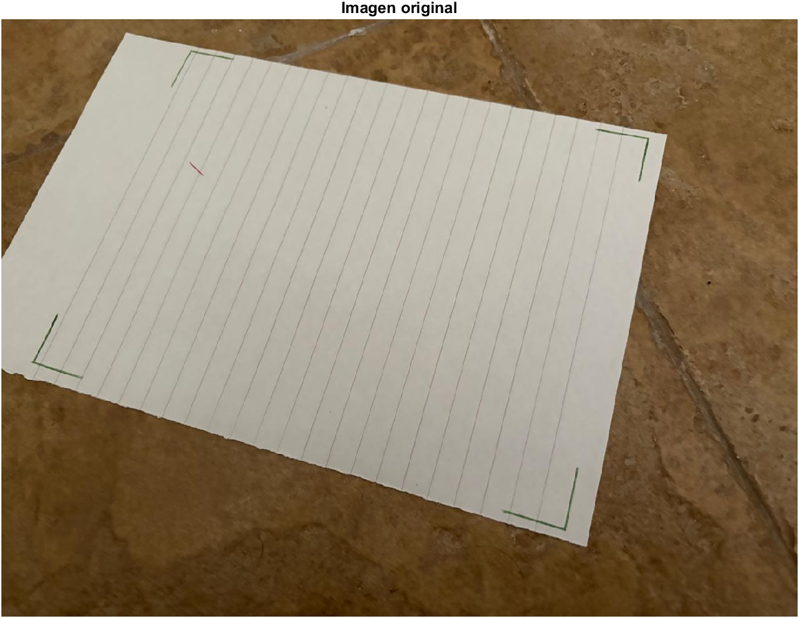
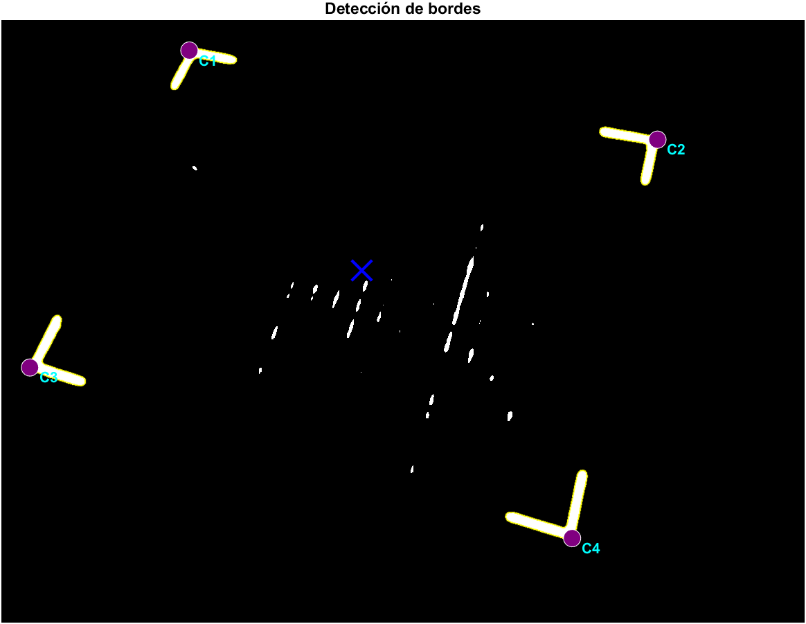
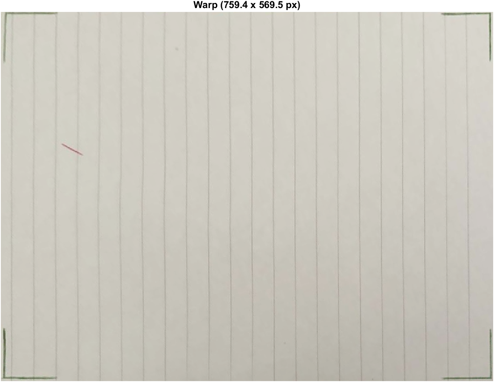
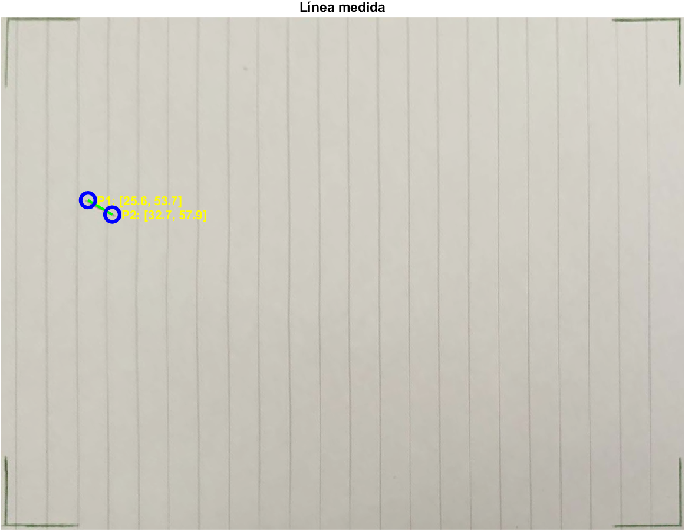

# Sistema de Visión para Robot - 22.90-TPF-AI

Sistema de visión por computadora para detección y medición de líneas rojas en un plano de trabajo de 200x150mm utilizando la biblioteca Peter Corke.

## Estructura del Proyecto

```
22.90-TPF-AI/
├── functions/          # Funciones del modelo de visión
│   ├── vision_model.m  # Función principal de detección
│   └── my_rgb2hsv.m    # Conversión RGB a HSV (sin dependencias externas)
├── img/                # Imágenes de prueba
├── doc/                # Documentación adicional
├── img_reader.m        # Script de prueba del modelo
└── README.md           # Este archivo
```

## Uso Rápido

```matlab
% Ejecutar el script de prueba
img_reader

% O usar la función directamente
addpath('functions');
[P1_mm, P2_mm, debug] = vision_model('img/new9.jpeg');
```

## Función Principal: `vision_model`

### Sintaxis
```matlab
[P1_mm, P2_mm, debug] = vision_model(imgInput, opts)
```

### Parámetros
- **imgInput**: Ruta de la imagen o matriz RGB
- **opts.showFigures**: (opcional, default: `false`) Mostrar visualización del procesamiento

### Retorno
- **P1_mm**: Coordenadas `[x, y]` del primer punto en mm (o `0` si falla)
- **P2_mm**: Coordenadas `[x, y]` del segundo punto en mm (o `0` si falla)
- **debug**: Estructura con `ok` (booleano) y `reason` (mensaje de error)

### Ejemplo
```matlab
opts = struct('showFigures', true);
[P1, P2, debug] = vision_model('img/test.jpeg', opts);

if ~isequal(P1, 0)
    fprintf('Punto 1: [%.2f, %.2f] mm\n', P1(1), P1(2));
    fprintf('Punto 2: [%.2f, %.2f] mm\n', P2(1), P2(2));
else
    fprintf('Error: %s\n', debug.reason);
end
```

## Pipeline de Procesamiento

### 1. Detección de Esquinas Verdes

*Imagen de entrada capturada por la cámara*


*Segmentación HSV + filtrado de blobs por aspect ratio*

- Ajuste gamma para normalización
- Filtro Niblack en canal verde
- Segmentación HSV: H ∈ [0.25, 0.65], S ∈ [0.15, 0.75]
- Filtrado de blobs: área > 300px, circularidad < 0.65, aspect ratio ∈ [0.3, 0.65]

### 2. Corrección de Perspectiva (Warp)

*Transformación homográfica al plano de trabajo 200x150mm*

- Homografía calculada desde 4 esquinas detectadas
- Resolución dinámica para mantener calidad
- Mapeo directo: píxeles → milímetros

### 3. Detección de Línea Roja

*Extremos de la línea detectados por algoritmo de distancia máxima*

- Realce por oponencia de color: `R - max(G, B)`
- Umbralización adaptativa (50% del máximo)
- Algoritmo de distancia máxima:
  1. Centroide de píxeles rojos
  2. Punto P1: píxel más alejado del centroide
  3. Punto P2: píxel más alejado de P1

## Especificaciones

- **Plano de trabajo**: 200mm × 150mm
- **Coordenadas**: Origen en esquina superior izquierda
- **Precisión**: Dependiente de la resolución de cámara (~0.2-0.5 mm/px)
- **Tolerancia angular**: Línea en cualquier orientación

## Dependencias

- **Peter Corke Robotics Toolbox**: `iread`, `idisp`, `iblobs`, `homography`, `homwarp`, etc.
- **Funciones propias**: `my_rgb2hsv` (reemplazo de `rgb2hsv` de MATLAB)

## Notas Técnicas

### Manejo de Errores
La función devuelve `0` en lugar de lanzar errores en los siguientes casos:
- Menos de 4 esquinas verdes detectadas
- Warp vacío o inválido
- No se detectan píxeles rojos

### Visualización
Cuando `showFigures = true`, se muestra una ventana con 4 subplots:
1. Imagen original
2. Detección de bordes (esquinas verdes)
3. Imagen warpeada
4. Línea roja con coordenadas en mm


**Autores**: Mariano Oms, Tomas Wickham, Santiago Michelotti, Lautaro Reynoso  
**Curso**: Automatización Industrial - 22.90  
**Última actualización**: Febrero 2026
