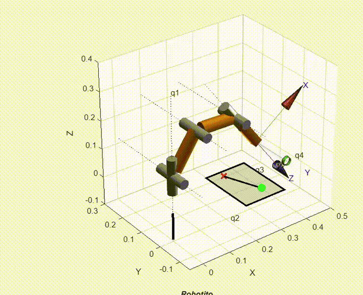
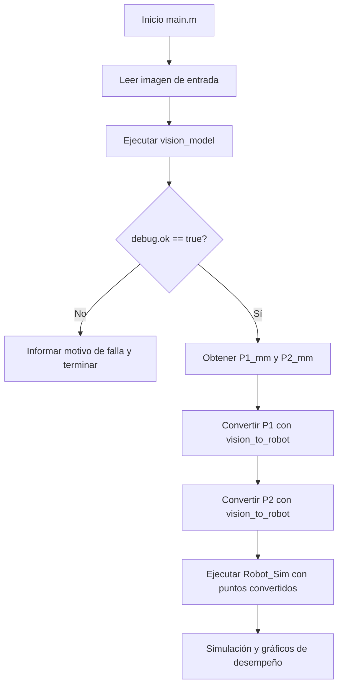
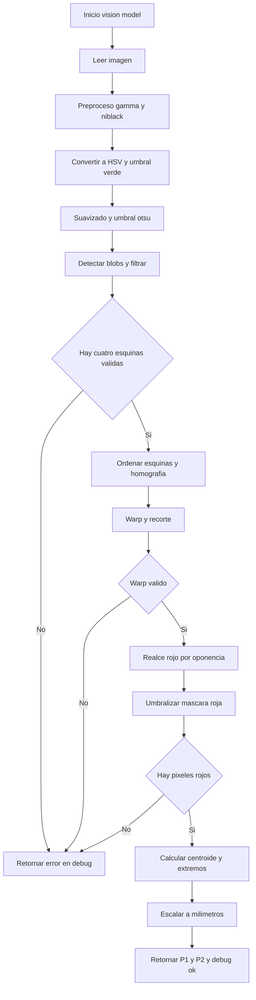
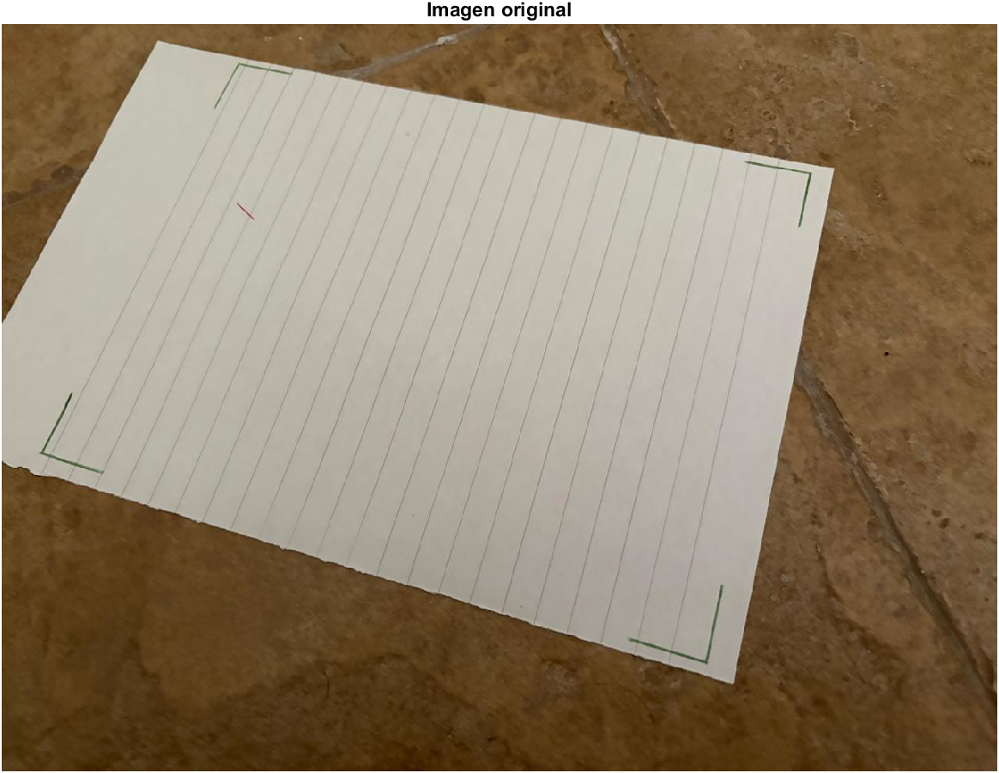
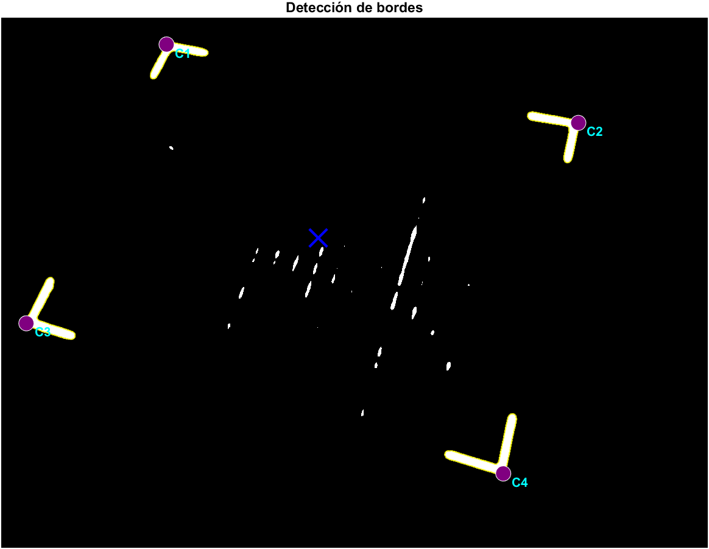
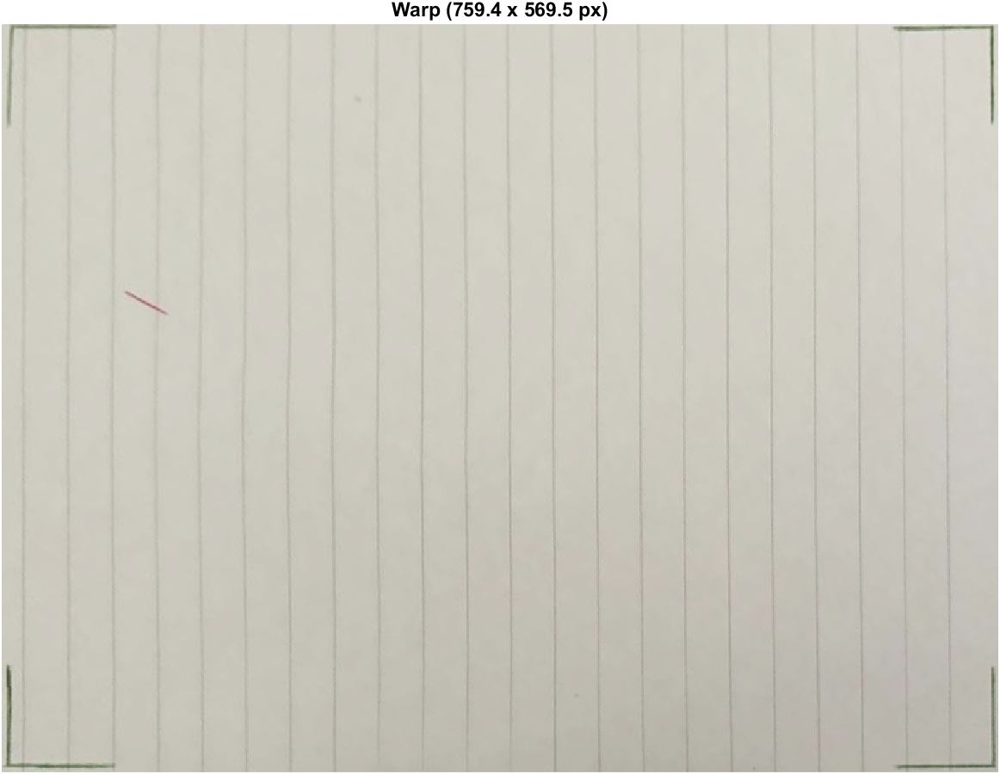
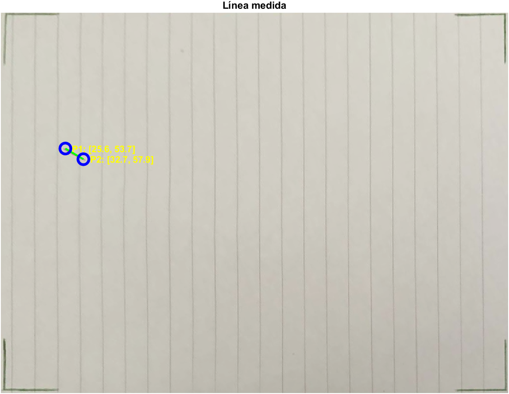
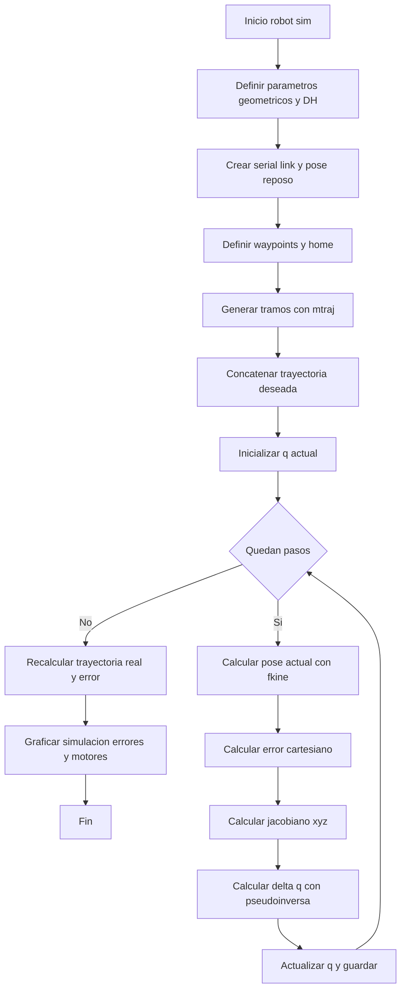

# Trabajo Practico Final, *22.90 Automacion Industrial*



## 1) Objetivo del proyecto

Este proyecto implementa, en MATLAB y con toolboxes de Peter Corke, una solución integrada de:

1. **Visión artificial** para detectar una recta roja sobre una zona de trabajo marcada en verde.
2. **Conversión geométrica** de coordenadas imagen/plano a coordenadas del robot.
3. **Simulación cinemática y control** de un brazo robótico para dibujar la recta detectada.

El flujo completo está diseñado para cumplir la consigna del examen final de **Automación Industrial 22.90** (Parte 1, 2 y 3).

---

## 2) Relación con la consigna (doc/Examen Final Diciembre 2025.pdf)

La implementación actual cubre los tres bloques pedidos:

- **Parte 1 (Modelo del robot):**
  - Se modela el robot con `SerialLink` y `Link` (DH modificado) en `functions/Robot_Sim.m`.
  - Se consideran longitudes físicas en mm y herramienta final (`tool` con `transl`).

- **Parte 2 (Control de trayectoria para dibujar una recta):**
  - Se define pose de reposo (`Qreposo`), waypoints, trayectoria particionada (`mtraj(@tpoly,...)`) y lazo iterativo con Jacobiano.
  - Se genera una trayectoria de aproximación, contacto, dibujo, retiro y regreso.

- **Parte 3 (Sistema de visión):**
  - Se detecta región de trabajo (esquinas verdes), se corrige perspectiva por homografía y se extraen extremos de la recta roja en coordenadas métricas del plano.


## 3) Estructura del repositorio

```
├── 📁 doc
├── 📁 functions
│   ├── 📄 Robot_Sim.m
│   ├── 📄 my_rgb2hsv.m
│   ├── 📄 vision_model.m
│   └── 📄 vision_to_robot.m
├── 📁 img
├── 📝 README.md
├── 📄 main.m
└── 📄 main_test.m
```

## 4) Diagrama de flujo general del proyecto


```mermaid
flowchart TD
    A[Inicio main.m] --> C[Leer imagen de entrada]
    C --> D[Ejecutar vision_model]

    D --> E{debug.ok == true?}
    E -- No --> F[Informar motivo de falla y terminar]
    E -- Sí --> G[Obtener P1_mm y P2_mm]

    G --> H[Convertir P1 con vision_to_robot]
    H --> I[Convertir P2 con vision_to_robot]
    I --> J[Ejecutar Robot_Sim con puntos convertidos]
    J --> K[Simulación y gráficos de desempeño]
```

---

## 5) Módulo de visión (`vision_model`)

### 5.1 Entradas/salidas

- **Entrada**
  - `imgInput`: path o imagen RGB en memoria.
  - `opts.showFigures`: habilita visualización del pipeline.

- **Salida**
  - `P1_mm = [x1, y1]`: extremo 1 de la recta en mm.
  - `P2_mm = [x2, y2]`: extremo 2 de la recta en mm.
  - `debug`: estructura con `ok` y `reason`.

### 5.2 Pipeline técnico

1. **Carga de imagen** (`iread` si se pasa ruta).
2. **Preprocesamiento**
   - Corrección gamma (`igamm(img, 0.75)`).
   - Filtro Niblack en canal verde.
3. **Segmentación de verde**
   - Conversión a HSV con `my_rgb2hsv`.
   - Ventanas de umbral en H y S para resaltar marco verde.
   - Suavizado gaussiano + umbral Otsu.
4. **Detección de blobs/esquinas**
   - `iblobs` + filtros por área, circularidad y aspect ratio.
   - Para cada blob candidato se extrae un punto extremo de borde.
   - Se validan 4 esquinas mínimas.
5. **Corrección de perspectiva**
   - Ordenado de esquinas (top-left, top-right, bottom-right, bottom-left).
   - Homografía (`homography`, `homwarp`) al plano de trabajo.
   - Recorte del warp útil.
6. **Detección de recta roja**
   - Oponencia de color: `R - max(G,B)`.
   - Umbral relativo al máximo.
   - Extracción de píxeles rojos.
7. **Cálculo de extremos**
   - Centroide de píxeles rojos.
   - `p1`: punto más lejano al centroide.
   - `p2`: punto más lejano a `p1`.
8. **Escalado a mm**
   - Escala x/y según dimensiones reales 200x150 mm.

### 5.3 Casos de error manejados

- No hay esquinas candidatas.
- Hay menos de 4 esquinas.
- Warp inválido/vacío.
- No hay píxeles rojos.

En esos casos devuelve `P1_mm = 0`, `P2_mm = 0` y mensaje en `debug.reason`.

### 5.4 Diagrama de flujo del módulo de visión


```mermaid
flowchart TD
  V0[Inicio vision model] --> V1[Leer imagen]
  V1 --> V2[Preproceso gamma y niblack]
  V2 --> V3[Convertir a HSV y umbral verde]
  V3 --> V4[Suavizado y umbral otsu]
  V4 --> V5[Detectar blobs y filtrar]
  V5 --> V6{Hay cuatro esquinas validas}
  V6 -- No --> V7[Retornar error en debug]
  V6 -- Si --> V8[Ordenar esquinas y homografia]
  V8 --> V9[Warp y recorte]
  V9 --> V10{Warp valido}
  V10 -- No --> V7
  V10 -- Si --> V11[Realce rojo por oponencia]
  V11 --> V12[Umbralizar mascara roja]
  V12 --> V13{Hay pixeles rojos}
  V13 -- No --> V7
  V13 -- Si --> V14[Calcular centroide y extremos]
  V14 --> V15[Escalar a milimetros]
  V15 --> V16[Retornar P1 y P2 y debug ok]
```

### 5.5 Resultados visuales del pipeline

<table>
  <tr>
    <td align="center"><br/>Imagen original</td>
    <td align="center"><br/>Blobs y esquinas detectadas</td>
  </tr>
  <tr>
    <td align="center"><br/>Warp (corrección de perspectiva)</td>
    <td align="center"><br/>Detección final de la recta roja</td>
  </tr>
</table>

---

## 6) Módulo de conversión (`vision_to_robot`)

Este módulo transforma coordenadas del plano de trabajo (en mm) a coordenadas del robot (en metros).

- Entrada esperada:
  - `u_mv` horizontal en rango aproximado `[0, 200]` mm.
  - `v_mv` vertical en rango aproximado `[0, 150]` mm.

- Transformación implementada:
  - $x_{mm} = 350 - v_{mv}$
  - $y_{mm} = 100 - u_{mv}$
  - $x_{m} = x_{mm}/1000$
  - $y_{m} = y_{mm}/1000$

Interpretación:

- A mayor `v_mv` (más “cerca” en la imagen), menor `x_m` del robot.
- A mayor `u_mv` (hacia la derecha), menor `y_m` del robot.

---

## 7) Módulo robot (`Robot_Sim`)

### 7.1 Modelado cinemático

- Define longitudes `L1..L5` (mm) y convierte a metros.
- Crea 5 links revolutos con DH modificado (`Link(...,'modified')`).
- Define herramienta final: `EE = transl(0,0,L5)`.
- Construye `SerialLink` del robot.
- Define pose de reposo `Qreposo` (elbow-up, segura para evitar choques).

### 7.2 Planificación de misión

Con puntos inicial/final recibidos:

- `W1_Aprox`: aproximación a altura segura.
- `W2_Contacto`: bajar al plano de dibujo.
- `W3_DibujoFin`: trazo lineal sobre el papel.
- `W4_Retiro`: retirar herramienta.
- Regreso a home.

### 7.3 Generación de trayectoria

- Genera 5 tramos con `mtraj(@tpoly,...)`.
- Concatena en una trayectoria cartesiana deseada `P_deseada`.

### 7.4 Control iterativo por Jacobiano

Para cada paso:

1. Calcula pose actual (`fkine`).
2. Evalúa error cartesiano de posición.
3. Usa Jacobiano base `jacob0`, toma submatriz traslacional `J_xyz`.
4. Obtiene corrección articular por pseudoinversa:
   - $\Delta q = J_{xyz}^{+} \cdot e$
5. Actualiza estado articular y guarda solución.

### 7.5 Validación y visualización

- Recalcula trayectoria real (`fkine`) y error en mm.
- Figura 2: simulación 3D + hoja + línea objetivo + traza del efector.
- Figura 3: comparación XYZ deseado vs real y errores de seguimiento.
- Figura 4: evolución de ángulos articulares.

### 7.6 Diagrama de flujo del módulo robot


```mermaid
flowchart TD
  R0[Inicio robot sim] --> R1[Definir parametros geometricos y DH]
  R1 --> R2[Crear serial link y pose reposo]
  R2 --> R3[Definir waypoints y home]
  R3 --> R4[Generar tramos con mtraj]
  R4 --> R5[Concatenar trayectoria deseada]
  R5 --> R6[Inicializar q actual]
  R6 --> R7{Quedan pasos}
  R7 -- No --> R8[Recalcular trayectoria real y error]
  R8 --> R9[Graficar simulacion errores y motores]
  R9 --> R10[Fin]
  R7 -- Si --> R11[Calcular pose actual con fkine]
  R11 --> R12[Calcular error cartesiano]
  R12 --> R13[Calcular jacobiano xyz]
  R13 --> R14[Calcular delta q con pseudoinversa]
  R14 --> R15[Actualizar q y guardar]
  R15 --> R7
  
```

---

## 8) Flujo de datos entre módulos

1. `vision_model` entrega extremos de recta en mm del plano: `P1_mm`, `P2_mm`.
2. `vision_to_robot` transforma esos puntos a base robot en metros: `(x1,y1)`, `(x2,y2)`.
3. `Robot_Sim` usa esos objetivos para generar y ejecutar trayectoria simulada.

---

## 9) Dependencias y entorno

- MATLAB.
- Robotics Toolbox (Peter Corke).
- Machine Vision Toolbox (Peter Corke).
- Imágenes en `img/` con marco verde y línea roja.
