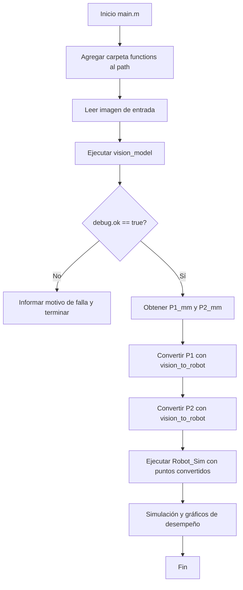

# Documentación Completa del Proyecto 22.90-TPF-AI

## 1) Objetivo del proyecto

Este proyecto implementa, en MATLAB y con toolboxes de Peter Corke, una solución integrada de:

1. **Visión artificial** para detectar una recta roja sobre una zona de trabajo marcada en verde.
2. **Conversión geométrica** de coordenadas imagen/plano a coordenadas del robot.
3. **Simulación cinemática y control** de un brazo robótico para dibujar la recta detectada.

El flujo completo está diseñado para cumplir la consigna del examen final de **Automación Industrial 22.90** (Parte 1, 2 y 3).

---

## 2) Relación con la consigna (doc/Examen Final Diciembre 2025.pdf)

La implementación actual cubre los tres bloques pedidos:

- **Parte 1 (Modelo del robot):**
  - Se modela el robot con `SerialLink` y `Link` (DH modificado) en `functions/Robot_Sim.m`.
  - Se consideran longitudes físicas en mm y herramienta final (`tool` con `transl`).

- **Parte 2 (Control de trayectoria para dibujar una recta):**
  - Se define pose de reposo (`Qreposo`), waypoints, trayectoria particionada (`mtraj(@tpoly,...)`) y lazo iterativo con Jacobiano.
  - Se genera una trayectoria de aproximación, contacto, dibujo, retiro y regreso.

- **Parte 3 (Sistema de visión):**
  - Se detecta región de trabajo (esquinas verdes), se corrige perspectiva por homografía y se extraen extremos de la recta roja en coordenadas métricas del plano.

---

## 3) Estructura del repositorio

- `main.m`: flujo principal integrado visión + robot.
- `main_test.m`: prueba directa del módulo robot sin visión real.
- `functions/vision_model.m`: pipeline completo de visión.
- `functions/vision_to_robot.m`: mapeo plano de trabajo → coordenadas robot.
- `functions/Robot_Sim.m`: modelo, planificación y simulación del robot.
- `functions/my_rgb2hsv.m`: conversión RGB→HSV propia.
- `doc/`: consigna, anexo y esta documentación.
- `img/`: imágenes de entrada para pruebas.

---

## 4) Diagrama de flujo general del proyecto



---

## 5) Módulo de visión (`vision_model`) – explicación detallada

### 5.1 Entradas/salidas

- **Entrada**
  - `imgInput`: path o imagen RGB en memoria.
  - `opts.showFigures`: habilita visualización del pipeline.

- **Salida**
  - `P1_mm = [x1, y1]`: extremo 1 de la recta en mm.
  - `P2_mm = [x2, y2]`: extremo 2 de la recta en mm.
  - `debug`: estructura con `ok` y `reason`.

### 5.2 Pipeline técnico

1. **Carga de imagen** (`iread` si se pasa ruta).
2. **Preprocesamiento**
   - Corrección gamma (`igamm(img, 0.75)`).
   - Filtro Niblack en canal verde.
3. **Segmentación de verde**
   - Conversión a HSV con `my_rgb2hsv`.
   - Ventanas de umbral en H y S para resaltar marco verde.
   - Suavizado gaussiano + umbral Otsu.
4. **Detección de blobs/esquinas**
   - `iblobs` + filtros por área, circularidad y aspect ratio.
   - Para cada blob candidato se extrae un punto extremo de borde.
   - Se validan 4 esquinas mínimas.
5. **Corrección de perspectiva**
   - Ordenado de esquinas (top-left, top-right, bottom-right, bottom-left).
   - Homografía (`homography`, `homwarp`) al plano de trabajo.
   - Recorte del warp útil.
6. **Detección de recta roja**
   - Oponencia de color: `R - max(G,B)`.
   - Umbral relativo al máximo.
   - Extracción de píxeles rojos.
7. **Cálculo de extremos**
   - Centroide de píxeles rojos.
   - `p1`: punto más lejano al centroide.
   - `p2`: punto más lejano a `p1`.
8. **Escalado a mm**
   - Escala x/y según dimensiones reales 200x150 mm.

### 5.3 Casos de error manejados

- No hay esquinas candidatas.
- Hay menos de 4 esquinas.
- Warp inválido/vacío.
- No hay píxeles rojos.

En esos casos devuelve `P1_mm = 0`, `P2_mm = 0` y mensaje en `debug.reason`.

### 5.4 Diagrama de flujo del módulo de visión

```mermaid
flowchart TD
    V0[Inicio vision_model] --> V1[Leer imagen]
    V1 --> V2[Gamma + Niblack en canal G]
    V2 --> V3[RGB->HSV + umbral verde]
    V3 --> V4[Suavizado + Otsu]
    V4 --> V5[iblobs + filtros geométricos]
    V5 --> V6{>= 4 esquinas válidas?}

    V6 -- No --> V7[Retornar error en debug.reason]
    V6 -- Sí --> V8[Ordenar esquinas y calcular homografía]
    V8 --> V9[Warp y recorte del plano]
    V9 --> V10{Warp no vacío?}

    V10 -- No --> V7
    V10 -- Sí --> V11[Realce rojo R-max(G,B)]
    V11 --> V12[Umbralizar máscara roja]
    V12 --> V13{Hay píxeles rojos?}

    V13 -- No --> V7
    V13 -- Sí --> V14[Centroide + extremos p1/p2]
    V14 --> V15[Escalar px a mm (200x150)]
    V15 --> V16[Retornar P1_mm, P2_mm, debug.ok=true]
```

---

## 6) Módulo de conversión (`vision_to_robot`) – explicación detallada

Este módulo transforma coordenadas del plano de trabajo (en mm) a coordenadas del robot (en metros).

- Entrada esperada:
  - `u_mv` horizontal en rango aproximado `[0, 200]` mm.
  - `v_mv` vertical en rango aproximado `[0, 150]` mm.

- Transformación implementada:
  - $x_{mm} = 350 - v_{mv}$
  - $y_{mm} = 100 - u_{mv}$
  - $x_{m} = x_{mm}/1000$
  - $y_{m} = y_{mm}/1000$

Interpretación:

- A mayor `v_mv` (más “cerca” en la imagen), menor `x_m` del robot.
- A mayor `u_mv` (hacia la derecha), menor `y_m` del robot.

---

## 7) Módulo robot (`Robot_Sim`) – explicación detallada

### 7.1 Modelado cinemático

- Define longitudes `L1..L5` (mm) y convierte a metros.
- Crea 5 links revolutos con DH modificado (`Link(...,'modified')`).
- Define herramienta final: `EE = transl(0,0,L5)`.
- Construye `SerialLink` del robot.
- Define pose de reposo `Qreposo` (elbow-up, segura para evitar choques).

### 7.2 Planificación de misión

Con puntos inicial/final recibidos:

- `W1_Aprox`: aproximación a altura segura.
- `W2_Contacto`: bajar al plano de dibujo.
- `W3_DibujoFin`: trazo lineal sobre el papel.
- `W4_Retiro`: retirar herramienta.
- Regreso a home.

### 7.3 Generación de trayectoria

- Genera 5 tramos con `mtraj(@tpoly,...)`.
- Concatena en una trayectoria cartesiana deseada `P_deseada`.

### 7.4 Control iterativo por Jacobiano

Para cada paso:

1. Calcula pose actual (`fkine`).
2. Evalúa error cartesiano de posición.
3. Usa Jacobiano base `jacob0`, toma submatriz traslacional `J_xyz`.
4. Obtiene corrección articular por pseudoinversa:
   - $\Delta q = J_{xyz}^{+} \cdot e$
5. Actualiza estado articular y guarda solución.

### 7.5 Validación y visualización

- Recalcula trayectoria real (`fkine`) y error en mm.
- Figura 2: simulación 3D + hoja + línea objetivo + traza del efector.
- Figura 3: comparación XYZ deseado vs real y errores de seguimiento.
- Figura 4: evolución de ángulos articulares.

### 7.6 Diagrama de flujo del módulo robot

```mermaid
flowchart TD
    R0[Inicio Robot_Sim] --> R1[Definir parámetros geométricos y DH]
    R1 --> R2[Crear SerialLink y pose Qreposo]
    R2 --> R3[Definir waypoints W1-W4 y home]
    R3 --> R4[Generar tramos con mtraj]
    R4 --> R5[Concatenar P_deseada]
    R5 --> R6[Inicializar q_actual]

    R6 --> R7{Quedan pasos?}
    R7 -- Sí --> R8[fkine -> P_actual]
    R8 --> R9[Error e = P_obj - P_actual]
    R9 --> R10[jacob0 -> J_xyz]
    R10 --> R11[dq = pinv(J_xyz)*e]
    R11 --> R12[Actualizar q_actual y guardar]
    R12 --> R7

    R7 -- No --> R13[Recalcular P_real y error]
    R13 --> R14[Graficar simulación, errores y motores]
    R14 --> R15[Fin]
```

---

## 8) Flujo de datos entre módulos

1. `vision_model` entrega extremos de recta en mm del plano: `P1_mm`, `P2_mm`.
2. `vision_to_robot` transforma esos puntos a base robot en metros: `(x1,y1)`, `(x2,y2)`.
3. `Robot_Sim` usa esos objetivos para generar y ejecutar trayectoria simulada.

---

## 9) Dependencias y entorno

- MATLAB.
- Robotics Toolbox (Peter Corke).
- Machine Vision Toolbox (Peter Corke).
- Imágenes en `img/` con marco verde y línea roja.

Funciones/toolbox utilizadas: `iread`, `igamm`, `niblack`, `kgauss`, `iconvolve`, `otsu`, `iblobs`, `homography`, `homwarp`, `homtrans`, `Link`, `SerialLink`, `fkine`, `jacob0`, `mtraj`, `tpoly`, `plot3`.

---

## 10) Limitaciones actuales y recomendaciones

### Limitaciones

- Los umbrales de color y filtros geométricos están calibrados para un tipo de iluminación/escena.
- El mapeo `vision_to_robot` es afín fijo; no corrige errores de montaje/calibración fina.
- El control por pseudoinversa no incluye explícitamente límites articulares ni singularity handling avanzado.

### Recomendaciones de mejora

1. Añadir calibración automática de umbrales HSV por escena.
2. Incorporar límites articulares y saturaciones de velocidad en el lazo de control.
3. Evaluar control con damping (DLS) para robustez cerca de singularidades.
4. Registrar métricas por corrida (error RMS, tiempo de ejecución, longitud de trazo).

---

## 11) Guía rápida de ejecución

1. Ubicarse en la raíz del proyecto.
2. Verificar que `functions/` esté en el path (ya lo hace `main.m`).
3. Colocar/seleccionar una imagen válida en `img/`.
4. Ejecutar `main.m`.

Salida esperada:

- Si visión falla: mensaje con motivo (`debug.reason`).
- Si visión es exitosa:
  - imprime coordenadas en mm,
  - convierte a coordenadas robot,
  - ejecuta simulación y abre figuras de trayectoria, error y motores.

---

## 12) Nota sobre consistencia de nombres

En el proyecto se utiliza la función `my_rgb2hsv(...)` desde `vision_model.m`. Conviene verificar que el nombre de la función declarada en `functions/my_rgb2hsv.m` coincida exactamente con el nombre del archivo en MATLAB, para evitar problemas de resolución de funciones.
